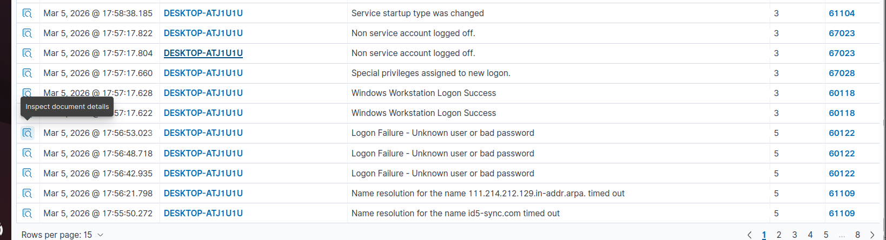
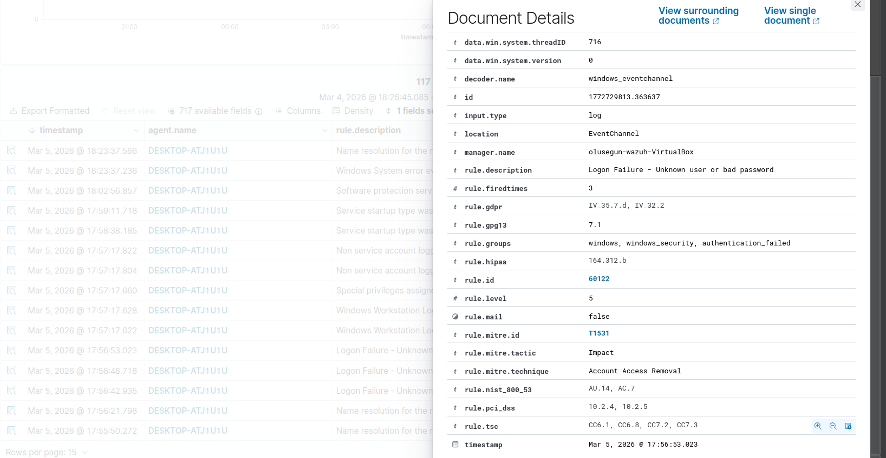

# 🚨 Detection Use Cases 

---

## 1️⃣ Brute Force Detection

Multiple 4625 events followed by 4624.

 
---

## 2️⃣ Suspicious Process Detection

4688 with:
* Encoded PowerShell
* Suspicious command-line arguments

---

## 3️⃣ Unauthorized Privilege Assignment

4732 adding user to Administrators.

---

## 4️⃣ Malicious Service Installation

System Event ID 7045.

---

## 5️⃣ Suspicious PowerShell Activity

4104 containing:
* IEX
* DownloadString
* EncodedCommand

---