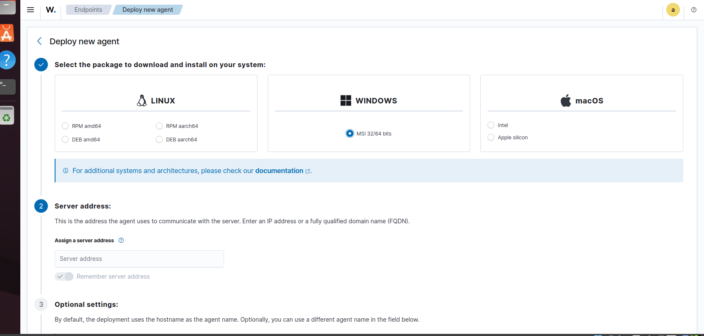
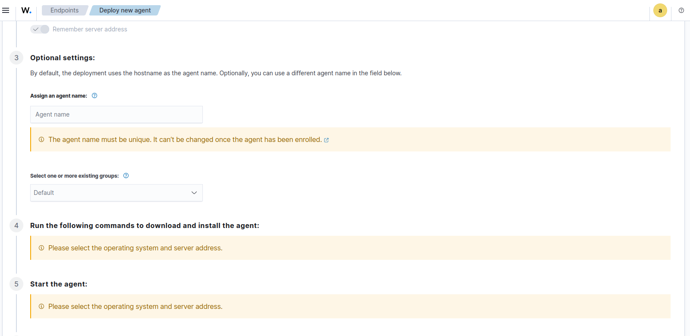
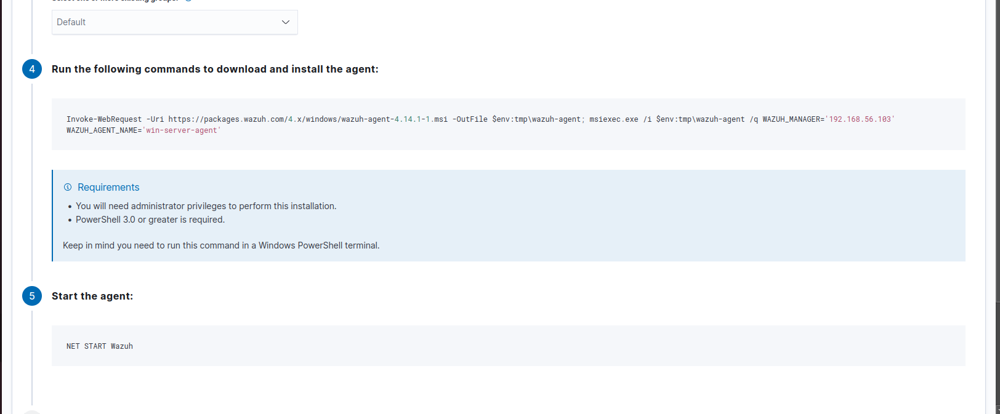
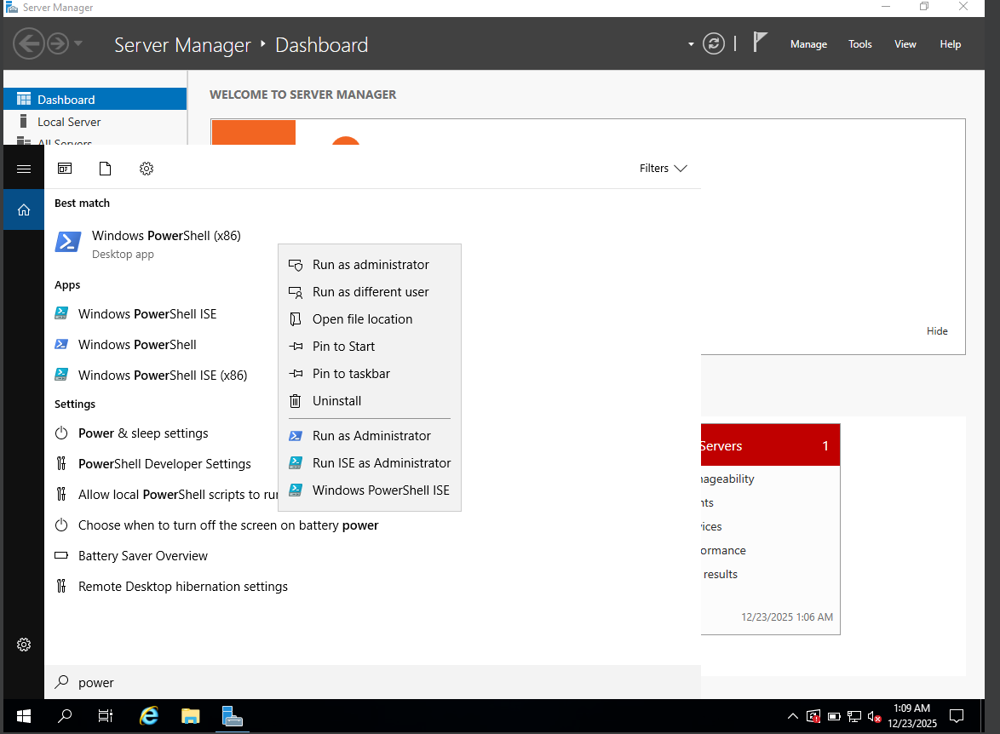

# Windows Server Enrollment into Wazuh

This document outlines the steps used to **enroll a Windows Server host into Wazuh** as part of a SOC monitoring and detection lab.
The goal is to enable **centralized log collection, endpoint visibility, and security monitoring** from Windows Server into the Wazuh manager.

---

## Prerequisites

Before enrolling the Windows Server, ensure the following:

* Wazuh Manager is installed and running
* Wazuh Dashboard is accessible
* Network connectivity exists between the Windows Server and Wazuh Manager
* Administrator privileges on the Windows Server

---

## Step 1: Create a Wazuh Agent Entry

1. Log in to the **Wazuh Dashboard**
2. Navigate to:
   **Agents → Deploy new agent**

 

3. Select:
* **Operating System:** Windows
* **Architecture:** (x64 or x86 depending on your server)

4. Copy the generated **agent installation and enrollment commands**

---

## Step 2: Install the Wazuh Agent on Windows Server

1. Log in to the Windows Server
2. Open **PowerShell as Administrator**

3. Run the provided Wazuh agent installation command, for example:

