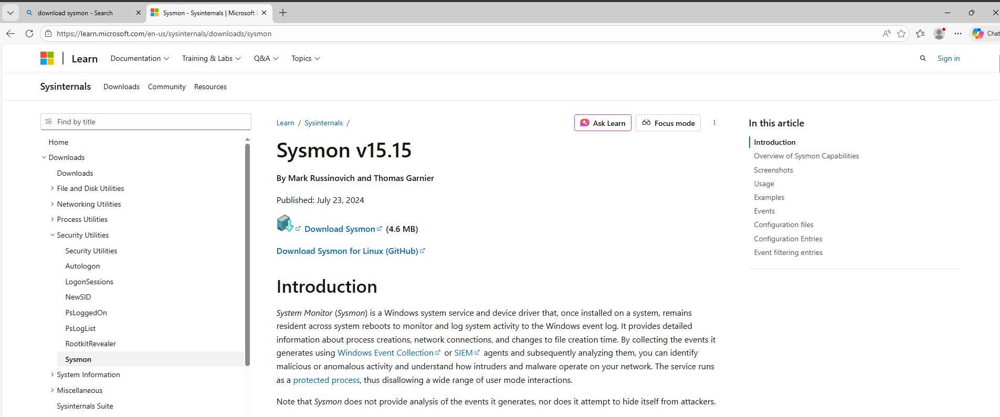
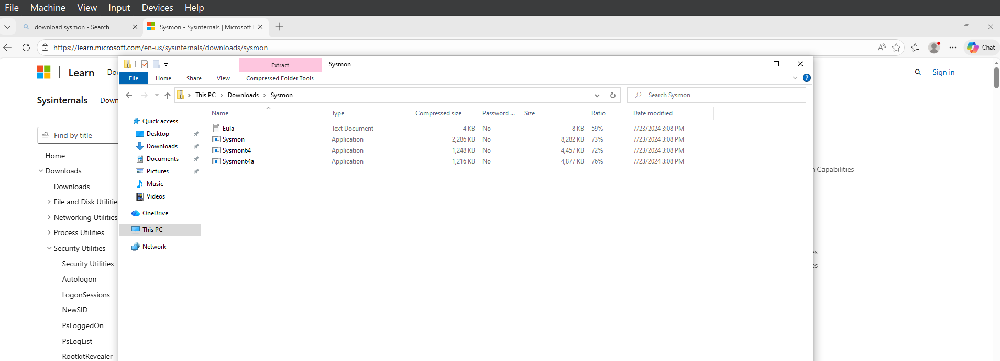
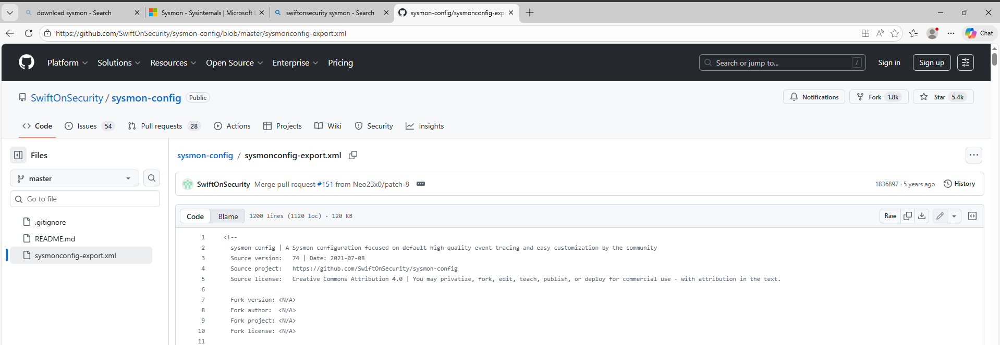
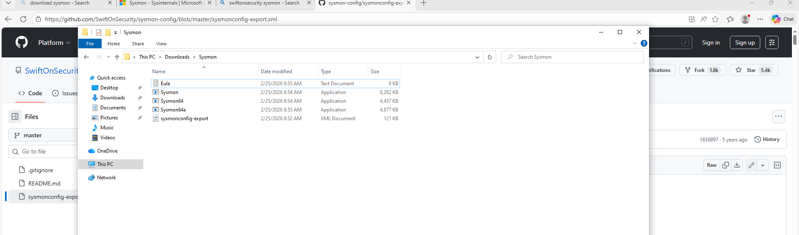
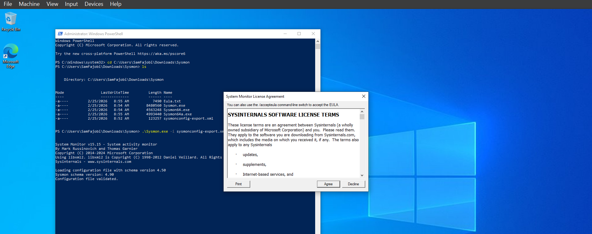
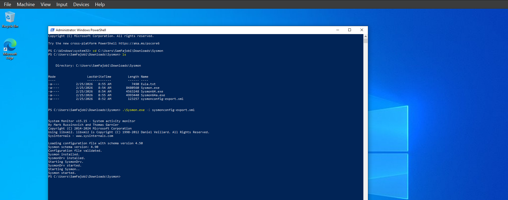
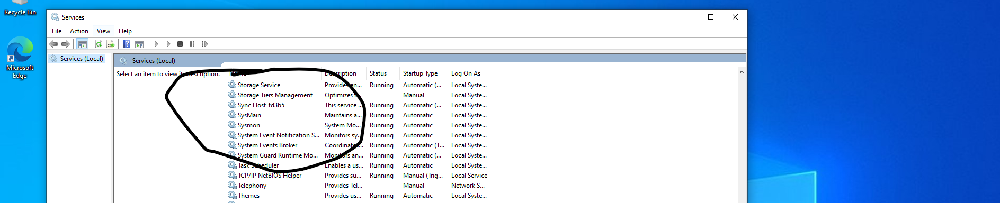
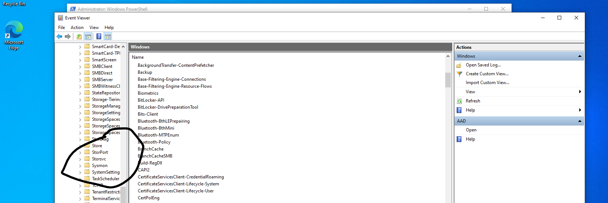
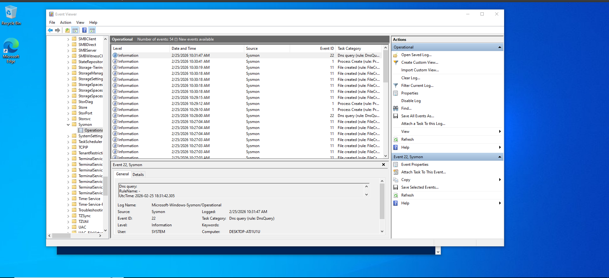

# Sysmon + Wazuh Integration Guide (Windows Endpoint Monitoring)

## Overview

This guide walks through installing **Sysmon (System Monitor)** on a Windows endpoint and integrating it with **Wazuh** for enhanced endpoint visibility and detection.

Sysmon provides deep telemetry such as:

- Process creation (with command line)
- Network connections
- File creation time changes
- Registry modifications
- Driver loads
- DNS queries

When integrated with Wazuh, this significantly improves detection capabilities.

---

# Architecture

```
Windows Endpoint
   ├── Windows Event Log
   ├── Sysmon (Event Logging)
   └── Wazuh Agent
           ↓
      Wazuh Manager
           ↓
      Wazuh Dashboard
```

---

# Prerequisites

- Windows 10 / 11 endpoint
- Administrator privileges
- Wazuh Agent installed and connected
- Internet access (to download Sysmon)
- PowerShell access

---

# Step 1 – Download Sysmon

1. Go to Microsoft Sysinternals official page:
   https://learn.microsoft.com/en-us/sysinternals/downloads/sysmon

   

2. Download **Sysmon.zip**

3. Extract contents to:

```
C:\Tools\Sysmon
```

You should see:

```
Sysmon.exe
Sysmon64.exe
Sysmon64a.exe
```
 
---

# Step 2 – Download a Sysmon Configuration File

Sysmon requires a configuration file to define what events to log.

Recommended community config:
- SwiftOnSecurity Sysmon config
- Olafhartong

Download from:
- https://github.com/SwiftOnSecurity/sysmon-config
- https://github.com/olafhartong/sysmon-modular

 

Save as:

```
C:\Tools\Sysmon\sysmonconfig.xml
```
 
---

# Step 3 – Install Sysmon

Open **PowerShell as Administrator**

Navigate to Sysmon directory:

```powershell
cd C:\Tools\Sysmon
```

Install Sysmon with config:

```powershell
.\Sysmon.exe -accepteula -i sysmonconfig.xml
```
Accept and continue

 

If successful, you will see:

```
Sysmon installed.
```
 

---

# Step 4 – Verify Sysmon Installation

Check if service is running:

```powershell
Get-Service Sysmon64
```

Or:

Click the windows button and go to **services**

 

Or:

Click the windows button and go to **event viewer**
- click on Application and Services
- click on Microsoft
- click on Windows
- Scroll down and find **Sysmon**

 

---

# Step 5 – Confirm Sysmon Events Are Logging

Open Event Viewer:

```
Event Viewer → Applications and Services Logs → Microsoft → Windows → Sysmon → Operational
```

You should see events such as:

- Event ID 1 – Process Creation
- Event ID 3 – Network Connection
- Event ID 7 – Image Loaded
- Event ID 11 – File Created
- Event ID 13 – Registry Value Set
- Event ID 22 – DNS Query



---

# Step 6 – Configure Wazuh Agent to Collect Sysmon Logs

Open:

```
C:\Program Files (x86)\ossec-agent\ossec.conf
```

Add the following inside the `<localfile>` section:

```xml
<localfile>
  <location>Microsoft-Windows-Sysmon/Operational</location>
  <log_format>eventchannel</log_format>
</localfile>
```

Save the file.

---

# Step 7 – Restart Wazuh Agent

Run PowerShell as Administrator:

```powershell
Restart-Service wazuh
```

Or:

```powershell
net stop wazuh
net start wazuh
```

---

# Step 8 – Verify Events in Wazuh Dashboard

1. Login to Wazuh Dashboard:
   https://<WAZUH-SERVER-IP>:5601

2. Go to:
   Security Events → Discover

3. Search:

```
rule.groups: sysmon
```

Or:

```
win.system.providerName: "Microsoft-Windows-Sysmon"
```

You should now see Sysmon events flowing into Wazuh.

---

# Step 9 – Test Sysmon Logging

## Test Process Creation

Run:

```powershell
notepad.exe
```

Check for:

- Event ID 1 (Process Creation)

---

## Test Network Connection

Run:

```powershell
ping google.com
```

Check for:

- Event ID 3 (Network Connection)

---

## Test DNS Query

Run:

```powershell
nslookup example.com
```

Check for:

- Event ID 22 (DNS Query)

---

# Useful Sysmon Event IDs

| Event ID | Description |
|----------|-------------|
| 1 | Process Creation |
| 3 | Network Connection |
| 7 | Image Loaded |
| 8 | CreateRemoteThread |
| 11 | File Created |
| 13 | Registry Value Set |
| 22 | DNS Query |


---

# Conclusion

Integrating Sysmon with Wazuh significantly improves endpoint visibility and detection capability. This setup allows monitoring of advanced behaviors such as:

- Process injection
- Command-line abuse
- Persistence techniques
- Network activity
- DNS behavior